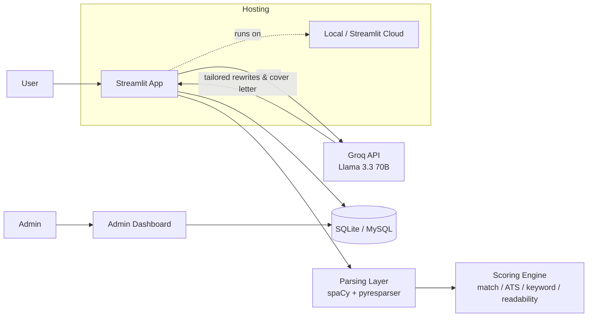

<div align="center">

# 🧠 AI Resume Analyzer

**Turn a resume into a career roadmap.**

Upload a PDF or DOCX resume — get back a predicted domain, a skill gap analysis, an ATS-style health score, and AI-generated resume/cover letter improvements, all in one dashboard.

[](https://python.org)
[](https://streamlit.io)
[](https://spacy.io)
[](https://groq.com)
[](https://www.sqlite.org/)
[](#-contributing)
[](./LICENSE)

**[🐛 Report Bug](https://github.com/Priyanshi0907/ResumeAI/issues)** · **[✨ Request Feature](https://github.com/Priyanshi0907/ResumeAI/issues)**

</div>

---

## 🤔 Why AI Resume Analyzer?

Most resume checkers stop at a generic "score out of 100" with no explanation of what to actually change. Job seekers are left guessing which skills are missing, whether their resume will even clear an ATS filter, and how to rewrite a bullet point so it lands.

AI Resume Analyzer closes that gap: it parses the resume properly with NLP, predicts the best-fit domain, diffs the candidate's skills against what that domain actually needs, and then hands the whole thing to an LLM to generate concrete, tailored rewrites — not just a score.

---

## ✨ Features

**AI-Powered Parsing**
Extracts candidate name, email, phone, and skills straight out of PDF/DOCX resumes — no manual data entry.

**Domain Recommendation**
Predicts the candidate's best-fit domain (Data Science, Web Development, Android, iOS, UI/UX Design, and more) from the parsed skill set.

**Skill Gap Analysis**
Highlights exactly which skills are missing for the predicted domain, so improvement is actionable, not vague.

**Match / ATS / Keyword / Readability Scoring**
A tabbed results view breaks the resume down by match score, ATS-friendliness, keyword coverage, and readability, instead of one opaque number.

**Tailored Resume & Cover Letter Generator**
Powered by Groq's Llama 3.3 70B, generates targeted resume line improvements and custom cover letters on demand.

**Resume Health Score**
Scores the resume out of 100 based on the standard sections a recruiter or ATS expects to see.

**Admin Dashboard**
Analytics panels, activity logs, and CSV export for anyone administering the tool at scale.

**Feedback & Rating System**
Captures user feedback directly to the database for continuous improvement.

---

## 🧭 How it works

```
Resume upload (PDF / DOCX)
            ↓
   Parsing & extraction (spaCy + pyresparser)
            ↓
  Domain prediction + skill gap analysis
            ↓
   ┌────────┴────────┐
   ↓                 ↓
Health / ATS /     Groq LLM
Match scoring      (Llama 3.3 70B)
   ↓                 ↓
        Tabbed results dashboard
   (scores · gaps · rewrites · cover letter)
```

---

## 🏗️ Architecture



- **App** (Streamlit): single-page, sidebar-free 3-step flow — upload, analyze, review tabbed results.
- **Parsing layer**: spaCy + a patched local `pyresparser` module extract structured fields from the resume.
- **Scoring engine**: computes match, ATS, keyword, and readability scores independently for the tabbed view.
- **AI layer**: Groq API (Llama 3.3 70B, free tier) generates tailored resume improvements and cover letters.
- **Data**: SQLite by default (zero-config), with optional MySQL for the admin dashboard and feedback log.

---

## 🛠️ Tech Stack

### Application
- **[Streamlit](https://streamlit.io/)** — single-page Python web app framework
- **[Python 3.10](https://python.org)** — core language
- **[spaCy v3](https://spacy.io/)** — NLP parsing and entity extraction
- **[pyresparser](https://github.com/OmkarPathak/pyresparser)** (local patched module) — resume field extraction

### AI / Intelligence
- **[Groq API](https://groq.com/)** — Llama 3.3 70B for resume rewrites and cover letter generation
- Domain classification and skill-gap logic — custom matcher against curated skill sets per domain

### Data
- **[SQLite](https://www.sqlite.org/)** — default zero-configuration database
- **[MySQL](https://www.mysql.com/)** — optional production-grade alternative for the admin dashboard

---

## ⚡ Performance

- Resume parsing runs synchronously per upload — typical PDF/DOCX processes in a few seconds
- AI rewrite and cover letter generation depend on Groq API latency (free tier)
- SQLite requires zero setup for local development; switch to MySQL for concurrent/admin-heavy use
- Health score, ATS score, keyword score, and readability score are computed independently, so partial results still render if one check fails

---

## 📁 Project Structure

```
AI-Resume-Analyzer/
├── App/
│   ├── __pycache__/
│   ├── Uploaded_Resumes/        # Storage for analyzed PDFs (gitignored)
│   ├── venv/                     # Virtual environment (gitignored)
│   ├── App.py                    # Main Streamlit application
│   ├── config.py                  # Configuration and env loader
│   ├── Courses.py                  # Curated courses and video data
│   ├── database.py                  # SQLite database layer
│   ├── patch.py                      # (purpose not confirmed — let me know what this does)
│   ├── requirements.txt               # Python package dependencies
│   ├── resume_analyzer.db              # SQLite database file (generated at runtime)
│   └── utils.py                         # Helper extraction logic & matchers
├── pyresparser/                 # Local patched resume parser module
│   ├── __pycache__/
│   ├── ner/                     # spaCy NER model files
│   │   ├── cfg
│   │   ├── model
│   │   └── moves
│   ├── vocab/                   # spaCy vocabulary data
│   │   ├── key2row
│   │   ├── lexemes.bin
│   │   ├── strings.json
│   │   └── vectors
│   ├── __init__.py
│   ├── CHANGELOG.md
│   ├── command_line.py
│   ├── constants.py
│   ├── custom_t.py
│   ├── custom_train.py
│   ├── meta.json
│   ├── requirements.txt
│   ├── resume_parser.py         # Core resume parsing logic
│   ├── skills.csv                # Skill taxonomy used for matching
│   ├── tokenizer
│   └── utils.py
├── .env
├── .env.example                  # Environment variables template
├── .gitignore                    # Git ignore rules
└── README.md                     # Documentation
```

---

## 🚀 Getting Started (Local Development)

### Prerequisites

- **Python** 3.10
- A **[Groq](https://groq.com/)** account for a free-tier API key

### 1. Clone the repository

```bash
git clone https://github.com/Priyanshi0907/ResumeAI.git
cd AI-Resume-Analyzer
```

### 2. Create and activate a virtual environment

```bash
python -m venv venv

# Windows
venv\Scripts\activate
# macOS/Linux
source venv/bin/activate
```

### 3. Install dependencies

```bash
pip install -r App/requirements.txt
```

### 4. Configure environment variables

```bash
cp .env.example .env
```

Open `.env` and set your Groq API key:

```env
GROQ_API_KEY=your_actual_groq_api_key_here
DB_TYPE=sqlite
SQLITE_PATH=resume_analyzer.db
ADMIN_USER=admin
ADMIN_PASS=admin@123
```

### 5. Run the application

```bash
cd App
streamlit run App.py
```

The app will be available at `http://localhost:8501`.

---

## 🗄️ Database

By default, the app uses **SQLite** for zero-configuration setup — a `resume_analyzer.db` file is created automatically on first run.

To use **MySQL** instead, set `DB_TYPE=mysql` in `.env` and configure the connection variables below.

---

## ⚙️ Environment Variables Reference

| Variable | Default Value | Description |
| :--- | :--- | :--- |
| `GROQ_API_KEY` | _(empty)_ | API key enabling AI resume improvements and cover letter generation |
| `DB_TYPE` | `sqlite` | Database selector (`sqlite` or `mysql`) |
| `SQLITE_PATH` | `resume_analyzer.db` | Path where the SQLite file should be written |
| `MYSQL_HOST` | `localhost` | MySQL server host address |
| `MYSQL_USER` | `root` | Username for MySQL database |
| `MYSQL_PASS` | _(empty)_ | Password for MySQL database |
| `MYSQL_DB` | `cv` | Database schema name |
| `ADMIN_USER` | `admin` | Admin dashboard login username |
| `ADMIN_PASS` | `admin@123` | Admin dashboard login password |

---

## 🔐 Admin Dashboard

Access the admin analytics panel with the credentials configured in `.env` (defaults below — change these before any real deployment):

- **Username:** `admin`
- **Password:** `admin@123`

---

## 🌐 Deployment

The app is a self-contained Streamlit application and can be deployed to **[Streamlit Community Cloud](https://streamlit.io/cloud)**, or containerized and hosted on any platform that supports Python. Set `GROQ_API_KEY` and the database variables as secrets/environment variables on whichever platform you choose.

---

## 🎨 Design Philosophy

AI Resume Analyzer is built around a few core principles:

- **Actionable over cosmetic** — a skill gap and a rewrite suggestion beat a bare number
- **Sidebar-free, single-page flow** — upload, analyze, review — nothing else to navigate
- **Fast local setup** — SQLite by default so anyone can run it in minutes
- **Tabbed transparency** — match, ATS, keyword, and readability scores are shown separately, not blended into one mystery figure
- **AI as an assist, not a black box** — Groq-generated rewrites are suggestions layered on top of deterministic parsing and scoring

---

## 🗺️ Roadmap

- [ ] LinkedIn profile import as an alternative to file upload
- [ ] Multi-resume comparison view
- [ ] Exportable PDF report of the full analysis
- [ ] Additional domain categories and skill taxonomies
- [ ] Resume version history per user
- [ ] Bulk analysis mode for recruiters

---

## 🤝 Contributing

Contributions are welcome. To contribute:

1. Fork the repository
2. Create a feature branch (`git checkout -b feature/your-feature`)
3. Commit your changes (`git commit -m "Add your feature"`)
4. Push to your branch (`git push origin feature/your-feature`)
5. Open a Pull Request

---

## 📄 License

This project is licensed under the terms specified in the [LICENSE](./LICENSE) file.

---

## 👤 Author

**Priyanshi Choudhary**
GitHub: [@Priyanshi0907](https://github.com/Priyanshi0907)